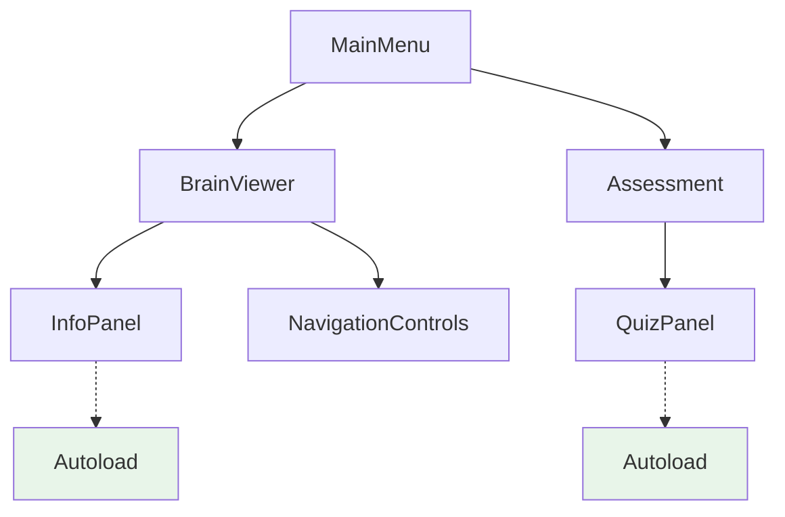

# Command: /audit-scene-architecture
# Purpose: Review scene organization, identify unused/deprecated files, and suggest architectural improvements
# Arguments:
#   - $AUDIT_SCOPE: What to audit (scenes, scripts, all, specific_directory)
#   - $ANALYSIS_DEPTH: How deep to analyze (quick, thorough, exhaustive)
#   - $INCLUDE_SUGGESTIONS: Include improvement suggestions (true/false)
#   - $CHECK_DEPRECATED: Check for deprecated Godot APIs (true/false)
#   - $SAFETY_LEVEL: How aggressive to be with removal suggestions (conservative, balanced, aggressive)
# Example: /audit-scene-architecture AUDIT_SCOPE="all" ANALYSIS_DEPTH="thorough" INCLUDE_SUGGESTIONS="true" SAFETY_LEVEL="balanced"
---

You are a Godot architecture specialist with expertise in scene organization, dependency management, and educational application structure.

TASK: Audit scene architecture and file organization for NeuroVision brain anatomy education app.

CONTEXT:
- NeuroVision has complex scene dependencies and reusable components
- 14 autoload managers may reference scenes/scripts dynamically
- Material3 UI components with scene inheritance
- Educational content must be preserved
- Project uses Godot 4.x scene format
- Audit scope: $AUDIT_SCOPE
- Analysis depth: ${ANALYSIS_DEPTH:="thorough"}
- Include suggestions: ${INCLUDE_SUGGESTIONS:="true"}
- Check deprecated: ${CHECK_DEPRECATED:="true"}
- Safety level: ${SAFETY_LEVEL:="balanced"}

REQUIREMENTS:
1. Scene Architecture Analysis:
   - Map scene hierarchy and dependencies
   - Identify inheritance chains
   - Find circular dependencies
   - Detect broken references
   - Analyze scene instantiation patterns
   - Check for duplicate functionality
   - Evaluate naming consistency

2. File Usage Detection:
   - Scan for unreferenced .tscn files
   - Find orphaned .gd scripts
   - Identify deprecated scenes
   - Detect duplicate components
   - Check for test/prototype files
   - Find backup/old versions
   - Locate empty or minimal files

3. Based on $ANALYSIS_DEPTH:
   - "quick": Basic reference checking
   - "thorough": + dependency mapping, duplication
   - "exhaustive": + performance impact, refactor opportunities

4. Deprecation Checking ($CHECK_DEPRECATED):
   - Godot 3.x → 4.x API changes
   - Deprecated node types
   - Old signal syntax
   - Legacy resource formats
   - Outdated project settings
   - Removed features usage

5. Organization Issues:
   - Inconsistent directory structure
   - Mixed component types
   - Poor naming conventions
   - Missing scene organization
   - Scattered related files
   - Deep nesting problems
   - Cross-module dependencies

6. Safety Analysis ($SAFETY_LEVEL):
   - "conservative": Only suggest obvious removals
   - "balanced": Include likely unused files
   - "aggressive": Suggest all potential removals

7. Architecture Problems:
   - Scene complexity (too many nodes)
   - Performance bottlenecks
   - Memory leaks (unreleased resources)
   - Inefficient scene structure
   - Missing scene inheritance
   - Poor component reusability
   - Tight coupling issues

CONSTRAINTS:
- Never suggest removing educational content
- Preserve all brain model references
- Keep accessibility implementations
- Maintain theme system files
- Consider dynamic loading patterns
- Respect autoload dependencies

OUTPUT:
## Scene Architecture Audit Report

### Executive Summary
- Total scenes analyzed: X
- Unused files found: X (Y MB)
- Deprecated code instances: X
- Architecture issues: X critical, Y moderate
- Estimated cleanup impact: Z% size reduction

### 🗂️ File Organization Analysis

#### Unused Files (Safe to Remove)
```
Path                          | Type  | Size  | Last Modified | Reason
-----------------------------|-------|-------|---------------|--------
src/old/OldPanel.tscn        | Scene | 15KB  | 6 months ago  | No references
src/test/TestComponent.gd    | Script| 2KB   | 1 year ago    | Test file
```

#### Potentially Unused (Verify Before Removal)
```
Path                          | Type  | Size  | Possible Usage
-----------------------------|-------|-------|----------------
src/ui/BackupPanel.tscn      | Scene | 20KB  | May be dynamically loaded
```

#### Deprecated Files (Need Migration)
```
Path                          | Issue                    | Migration Path
-----------------------------|--------------------------|----------------
src/legacy/OldButton.gd      | Uses Godot 3.x syntax   | Update to 4.x
```

### 🏗️ Scene Architecture Issues

#### Critical Issues
1. **Circular Dependency: BrainViewer ↔ InfoPanel**
   - Current: Both scenes reference each other
   - Impact: Loading delays, memory issues
   - Solution: Extract shared interface to separate scene
   ```
   // Suggested refactor
   SharedInterface.tscn
   ├── BrainViewer.tscn (instantiates SharedInterface)
   └── InfoPanel.tscn (instantiates SharedInterface)
   ```

2. **Over-complex Scene: AssessmentScene.tscn**
   - Node count: 847 (recommended max: 200)
   - Nesting depth: 12 levels (recommended max: 5)
   - Solution: Break into subscenes

#### Moderate Issues
1. **Duplicate Components**
   ```
   src/ui/InfoPanel.tscn
   src/ui/panels/InformationPanel.tscn  // 90% similar
   ```
   Recommendation: Merge and create variants

2. **Inconsistent Organization**
   ```
   Current:                    Suggested:
   src/                       src/
   ├── BrainViewer.gd        ├── scenes/
   ├── ui/                   │   ├── main/
   ├── scenes/               │   ├── components/
   └── components/           │   └── overlays/
                            └── scripts/
                                ├── controllers/
                                ├── components/
                                └── utilities/
   ```

### 📊 Dependency Map



### 🔍 Code Quality Issues

#### Deprecated API Usage
```gdscript
# Found in: src/old/LegacyController.gd
# Godot 3.x syntax
onready var panel = $Panel  # Line 15

# Should be:
@onready var panel = $Panel
```

#### Performance Concerns
1. **Heavy Scene: BrainModelFull.tscn**
   - Load time: 3.2s
   - Memory: 450MB
   - Suggestion: Implement progressive loading

### 🛠️ Improvement Suggestions

#### Immediate Actions (Quick Wins)
1. **Remove obvious unused files**
   ```bash
   # Safe removals (backup first)
   rm src/old/*.tscn
   rm src/test/*.gd
   rm src/backup_*
   ```

2. **Fix deprecated syntax**
   - Update 23 files with old signal syntax
   - Convert onready → @onready (15 instances)

#### Short-term Improvements
1. **Reorganize scene structure**
   ```
   scenes/
   ├── main/
   │   ├── MainMenu.tscn
   │   ├── BrainViewer.tscn
   │   └── Assessment.tscn
   ├── components/
   │   ├── shared/
   │   ├── ui_panels/
   │   └── 3d_controls/
   └── resources/
       ├── themes/
       └── shaders/
   ```

2. **Create scene templates**
   - BasePanel.tscn for consistent panels
   - BaseButton.tscn for button variants

#### Long-term Architecture
1. **Implement proper MVC pattern**
   - Separate views from logic
   - Create view models
   - Use signals for communication

2. **Scene pooling system**
   - Reuse heavy components
   - Reduce instantiation overhead

### 📋 Action Priority Matrix

| Priority | Action | Impact | Effort | Risk |
|----------|--------|--------|--------|------|
| 🔴 High  | Remove unused files | -30MB | Low | Low |
| 🔴 High  | Fix circular deps | Performance++ | Medium | Medium |
| 🟡 Medium | Reorganize structure | Maintainability++ | High | Low |
| 🟡 Medium | Update deprecated | Future-proof | Medium | Low |
| 🟢 Low   | Optimize heavy scenes | Performance+ | High | Medium |

### 🧹 Cleanup Script

```bash
#!/bin/bash
# Generated cleanup script (review before running)

# Backup first
cp -r src/ src_backup_$(date +%Y%m%d)

# Remove confirmed unused files
rm -f src/old/OldPanel.tscn
rm -f src/test/TestComponent.gd

# Update deprecated syntax
find . -name "*.gd" -exec sed -i 's/onready var/@onready var/g' {} +

echo "Cleanup complete. Removed X files, saved Y MB"
```

### 📊 Metrics After Cleanup

- Estimated size reduction: 30-50MB
- Scene load time improvement: 15-20%
- Reduced complexity score: 40%
- Better maintainability index

### ✅ Validation Checklist

Before implementing changes:
- [ ] Backup entire project
- [ ] Test all main workflows
- [ ] Verify autoload dependencies
- [ ] Check dynamic loading paths
- [ ] Test on target hardware
- [ ] Validate educational features
- [ ] Confirm accessibility works

SUCCESS CRITERIA: Clean architecture, no broken dependencies, improved performance, maintains all educational functionality