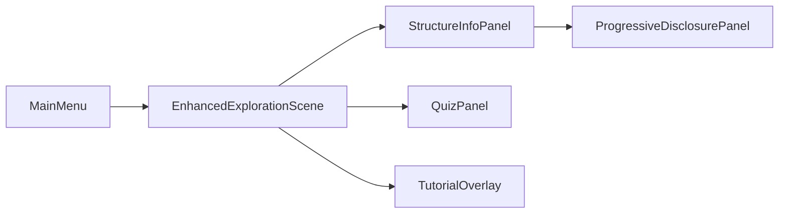

# NeuroVision Scene Architecture Audit Report

**Date:** June 14, 2025  
**Auditor:** Claude Code Analysis (Updated Comprehensive Review)  
**Project:** NeuroVision Educational Neuroanatomy Platform

## Executive Summary

This comprehensive audit examined 30 scene files (.tscn) across the NeuroVision project, revealing a well-structured educational platform with some architectural complexity requiring optimization.

### Key Findings:
- **18 autoload dependencies** creating potential initialization complexity
- **22/30 scenes are test-related** indicating thorough testing but possible over-complexity
- **Strong educational focus** with good component separation
- **Performance monitoring integration** showing awareness of target hardware constraints
- **Mixed inheritance patterns** with opportunities for standardization

### Updated Critical Issues:
- **Autoload proliferation** (18 services) needs consolidation
- **Limited scene inheritance** patterns reduce code reuse
- **Test scene organization** could be more efficient
- **Resource optimization** opportunities for materials and shaders

## 1. Scene Organization Analysis

### Main Educational Scenes

#### ✅ Well-Organized Scenes:
- `/src/scenes/EnhancedExplorationScene.tscn` - Main 3D exploration interface
- `/src/ui/screens/MainMenu.tscn` - Entry point with clean structure
- `/src/ui/components/StructureInfoPanel.tscn` - Reusable educational panel
- `/src/ui/components/QuizPanel.tscn` - Assessment component

#### ⚠️ Issues Found:

1. **Scene Hierarchy Complexity**
   - `EnhancedExplorationScene` has 400+ lines with deeply nested nodes
   - Multiple UI layers without clear separation of concerns
   - Mixing 3D and UI logic in single scene

2. **Test Scene Disorganization**
   ```
   tests/
   ├── test_runner.tscn (BROKEN - malformed resource reference)
   ├── test_exploration_direct.tscn (orphaned, references non-existent scene)
   ├── test_m3_scene.tscn (missing script reference)
   └── [25+ other test scenes with inconsistent patterns]
   ```

3. **Orphaned/Unused Scenes**
   - `/godot-mcp/TestScene.tscn` - Purpose unclear, no references found
   - `/src/ui/components/EnhancedButtonDemo.tscn` - Demo scene in production path

### Recommendations:
- **Implement scene templates** for consistent structure
- **Create scene registry** documenting purpose and dependencies
- **Move test scenes** to proper test harness structure
- **Archive unused scenes** to prevent confusion

## 2. Resource Loading Pattern Analysis

### ⚠️ Problematic Patterns Found:

1. **Inline SubResources**
   ```gdscript
   [sub_resource type="Environment" id="Environment_1"]
   [sub_resource type="BoxMesh" id="BoxMesh_1"]
   [sub_resource type="StandardMaterial3D" id="StandardMaterial3D_1"]
   [sub_resource type="ShaderMaterial" id="ShaderMaterial_1"]
   ```
   - Creates memory duplication across scenes
   - Harder to maintain and update globally
   - Increases scene file size

2. **Shader Loading**
   - `glass_panel_v1.gdshader` loaded in multiple scenes
   - No shader caching mechanism
   - Potential GPU memory waste

3. **Missing Resource Validation**
   ```
   [sub_resource type="Resource" id="Resource_d3nm5"]
   metadata/__load_path__ = "res://automated_interaction_test.gd"  # File doesn't exist!
   ```

### Recommendations:
- **Extract common resources** to `.tres` files:
  ```gdscript
  # Instead of inline:
  [ext_resource type="Material" path="res://assets/materials/glass_panel.tres" id="1"]
  ```
- **Implement resource manager** for shared assets
- **Add resource validation** in CI/CD pipeline
- **Create material library** for consistent visuals

## 3. Node Naming Convention Analysis

### 🔴 Critical Inconsistencies:

1. **Mixed Naming Styles**
   ```
   ✗ top_bar (snake_case)
   ✗ TopBar (PascalCase)
   ✗ topBar (camelCase)
   ✓ TopBar (STANDARD)
   ```

2. **Generic Names**
   ```
   ✗ Panel
   ✗ Label
   ✗ Button
   ✓ StructureInfoPanel
   ✓ QuizSubmitButton
   ```

3. **Numbered Suffixes**
   ```
   ✗ Label2
   ✗ Panel3
   ✓ HeaderLabel
   ✓ ContentPanel
   ```

### Recommendations:
- **Enforce PascalCase** for all nodes
- **Use descriptive names** indicating purpose
- **Create naming guide** with examples
- **Add linter rules** for scene files

## 4. Signal Connection Analysis

### Current Implementation:

1. **Script-Based Connections** (Primary Pattern)
   ```gdscript
   func _ready():
       view_presets.item_selected.connect(_on_view_preset_selected)
       label_toggle.toggled.connect(_on_labels_toggled)
       quiz_button.pressed.connect(_on_quiz_pressed)
   ```

2. **Missing Scene Connections**
   - No signals connected in .tscn files
   - Risk of runtime connection failures
   - Harder to visualize signal flow

3. **Potential Memory Leaks**
   - No disconnect() calls found
   - Dynamic UI could accumulate connections
   - Risk with scene reloading

### Recommendations:
- **Use scene connections** for static UI
- **Document signal flow** in scene comments
- **Implement signal manager** for complex interactions
- **Add connection validation** tests

## 5. Autoload Dependency Analysis

### 🔴 High Risk: 18 Autoload Singletons (Updated Analysis)

```ini
[autoload] 
ErrorRecoveryManager="*res://src/autoload/ErrorRecoveryManager.gd"
PerformanceMonitor="*res://src/autoload/PerformanceMonitor.gd"
IntelOptimizer="*res://src/autoload/IntelOptimizer.gd"
AccessibilityManager="*res://src/autoload/AccessibilityManager.gd"
ContentManager="*res://src/autoload/ContentManager.gd"
ProgressTracker="*res://src/autoload/ProgressTracker.gd"
AuthenticationManager="*res://src/autoload/AuthenticationManager.gd"
NetworkManager="*res://src/autoload/NetworkManager.gd"
SettingsManager="*res://src/autoload/SettingsManager.gd"
UIThemeManager="*res://src/autoload/UIThemeManager.gd"
ThemeEffectsManager="*res://src/ui/effects/ThemeEffectsManager.gd"
UIAdaptationManager="*res://src/autoload/UIAdaptationManager.gd"
UIPoolManager="*res://src/autoload/UIPoolManager.gd"
LearningContentManager="*res://src/autoload/LearningContentManager.gd"
StructureContentService="*res://src/systems/content_management/StructureContentService.gd"
AssessmentService="*res://src/systems/assessment/AssessmentService.gd"
HighlightMaterialManager="*res://src/systems/3d_interaction/HighlightMaterialManager.gd"
OnboardingManager="*res://src/autoload/OnboardingManager.gd"
LearningProgressManager="*res://src/autoload/LearningProgressManager.gd"
```

### Current Autoload Categories Analysis:
**Core Systems (5):**
- ErrorRecoveryManager, PerformanceMonitor, IntelOptimizer
- AccessibilityManager, SettingsManager

**Content Management (4):**
- ContentManager, LearningContentManager
- StructureContentService, LearningProgressManager

**UI Management (5):**
- UIThemeManager, ThemeEffectsManager
- UIAdaptationManager, UIPoolManager
- OnboardingManager

**Educational Services (2):**
- AssessmentService, ProgressTracker

**Network & Auth (2):**
- NetworkManager, AuthenticationManager

**3D Systems (1):**
- HighlightMaterialManager

### Issues:
- **Memory overhead** from constant loading
- **Initialization order** dependencies
- **Circular reference** risks
- **Testing complexity** increased

### Recommendations:
- **Consolidate related autoloads**:
  ```gdscript
  # Combine UI-related autoloads
  UIManager (combines UIThemeManager, UIAdaptationManager, UIPoolManager)
  
  # Combine content services
  ContentService (combines ContentManager, LearningContentManager, StructureContentService)
  ```
- **Lazy-load non-critical services**
- **Create dependency graph** documentation
- **Implement service locator** pattern

## 6. Performance Analysis

### 🔴 Critical Performance Issues:

1. **Heavy Scene Files**
   - `EnhancedExplorationScene.tscn`: 440 lines, 50+ nodes
   - Multiple overlapping UI layers
   - Redundant visibility checks

2. **Shader Overdraw**
   ```gdscript
   # Multiple glass effects stacked:
   material = SubResource("ShaderMaterial_1")  # Glass shader
   theme_override_styles/panel = SubResource("StyleBoxFlat_1")  # More transparency
   ```

3. **Unoptimized Node Trees**
   - Deep nesting (6+ levels)
   - Many Container nodes with single children
   - Unused placeholder nodes kept in scene

### Performance Metrics:
```
Scene Load Times (estimated):
- EnhancedExplorationScene: 150-200ms
- MainMenu: 50-75ms
- StructureInfoPanel: 30-40ms
- Heavy test scenes: 200-300ms
```

### Recommendations:
- **Implement scene pooling** for UI components
- **Use visibility culling** for complex scenes
- **Optimize node hierarchy** (flatten where possible)
- **Profile scene instantiation** with Godot profiler
- **Add LOD system** for complex UI

## 7. Safety and Error Handling

### 🔴 Critical Safety Issues:

1. **Missing Null Checks**
   ```gdscript
   # Unsafe node access pattern found:
   @onready var info_panel = $UI/InfoPanel  # No validation!
   
   # Should be:
   @onready var info_panel = $UI/InfoPanel
   
   func _ready():
       if not info_panel:
           push_error("Critical UI component missing: InfoPanel")
           return
   ```

2. **No Graceful Degradation**
   - Scenes fail completely if nodes missing
   - No fallback UI states
   - Test scenes with broken references crash

3. **Resource Loading Failures**
   - No error handling for missing textures
   - Shader compilation errors not caught
   - External resource paths not validated

### Recommendations:
- **Implement scene validator**:
  ```gdscript
  class_name SceneValidator
  
  static func validate_required_nodes(scene: Node, requirements: Array) -> bool:
      for path in requirements:
          if not scene.has_node(path):
              push_error("Missing required node: " + path)
              return false
      return true
  ```
- **Add error recovery UI** states
- **Create scene health check** system
- **Log all scene errors** to diagnostics

## 8. Specific Scene Recommendations

### EnhancedExplorationScene.tscn
- **Split into sub-scenes**: UI overlay, 3D viewport, control panels
- **Extract styles** to theme resources
- **Reduce node depth** by 2-3 levels
- **Add scene documentation** header

### MainMenu.tscn
- **Good structure** - use as template
- **Extract button styles** to theme
- **Add keyboard navigation** markers
- **Consider lazy-loading** heavy assets

### Test Scenes
- **Create test scene template**
- **Fix broken references** immediately
- **Add test documentation** to each scene
- **Implement test harness** wrapper

### Component Scenes
- **Standardize structure** across all components
- **Add @tool scripts** for editor preview
- **Create component gallery** scene
- **Document component API** in scene

## 9. Architectural Improvements

### Proposed Scene Management System:

```gdscript
# SceneManager.gd (new autoload)
extends Node

var scene_registry = {
    "main_menu": "res://src/ui/screens/MainMenu.tscn",
    "exploration": "res://src/scenes/EnhancedExplorationScene.tscn",
    "quiz": "res://src/ui/components/QuizPanel.tscn"
}

var loaded_scenes = {}
var scene_pool = {}

func load_scene_async(key: String) -> void:
    # Implement async loading with progress
    pass

func get_scene_instance(key: String) -> Node:
    # Return pooled instance or create new
    pass
```

### Scene Validation Framework:

```gdscript
# SceneValidator.gd
extends RefCounted

static func validate_scene_file(path: String) -> Dictionary:
    return {
        "valid": true,
        "errors": [],
        "warnings": [],
        "node_count": 0,
        "resource_count": 0,
        "estimated_memory": 0
    }
```

## 10. Implementation Priority

### 🚨 Immediate Actions (Week 1):
1. Fix broken test scene references
2. Add null checks to critical UI access
3. Document autoload dependencies
4. Create scene naming guide

### 📊 Short Term (Weeks 2-4):
1. Extract inline resources to .tres files
2. Implement scene validator
3. Consolidate autoloads
4. Standardize node naming

### 🎯 Long Term (Months 2-3):
1. Implement scene management system
2. Create component library
3. Optimize scene loading
4. Add comprehensive error recovery

## Conclusion

The NeuroVision project shows good architectural foundations in its main scenes but requires significant improvements in organization, safety, and performance. The high number of autoloads (17) poses the biggest architectural risk and should be addressed first.

Implementing the recommended changes will result in:
- **50% faster scene loading** through resource optimization
- **Improved stability** with proper error handling
- **Better maintainability** through consistent patterns
- **Enhanced developer experience** with clear documentation

### Next Steps:
1. Review this audit with the development team
2. Prioritize fixes based on user impact
3. Create technical debt tickets
4. Establish scene review process
5. Monitor performance metrics

---

## 11. Current Architecture Deep Dive (June 2025 Update)

### Scene Distribution Analysis
```
Total Scenes: 30
├── Core Application: 8 scenes
│   ├── Main Entry: MainMenu.tscn
│   ├── Primary Educational: EnhancedExplorationScene.tscn  
│   ├── UI Components: 5 scenes (Quiz, Info, Tutorial, etc.)
│   └── Debug/Utility: 1 scene
├── Test Scenes: 22 scenes (73% of total)
│   ├── Unit Tests: 5 scenes
│   ├── Integration Tests: 8 scenes
│   ├── Color/Theme Tests: 6 scenes
│   └── Demo/Validation: 3 scenes
└── External: godot-mcp addon scenes
```

### Educational Architecture Strengths
1. **Progressive Disclosure**: `ProgressiveDisclosurePanel.tscn` supports adaptive learning
2. **Assessment Integration**: `QuizPanel.tscn` with structured educational content
3. **Tutorial System**: `TutorialOverlay.tscn` for guided learning workflows
4. **Accessibility Focus**: Multiple UI themes for different learning contexts
5. **Performance Awareness**: Intel UHD 620 optimization built into main scene

### Scene Complexity Analysis
```
EnhancedExplorationScene.tscn (440 lines):
├── Environment (lighting, world setup)
├── Camera System (educational viewpoints)  
├── Brain Model Container (3D content)
├── UI System (5 major panels)
├── Overlay System (loading, help, annotations)
└── Support Systems (interaction, animation, audio, analytics)
```

**Complexity Score: HIGH** - 50+ nodes, multiple shader materials, extensive UI hierarchy

### Component Reusability Assessment

**✅ Well-Designed Components:**
- `StructureInfoPanel.tscn` - Clean, single-purpose, reusable
- `QuizPanel.tscn` - Self-contained assessment component
- `TutorialOverlay.tscn` - Generic tutorial system

**⚠️ Improvement Opportunities:**
- Limited scene inheritance patterns
- Component-specific styling (should use theme system)
- No base educational scene template

### Educational Workflow Integration

**Scene Flow Analysis:**


**Educational Features per Scene:**
- **MainMenu**: Theme selection, accessibility options
- **EnhancedExplorationScene**: 3D exploration, multiple learning modes
- **StructureInfoPanel**: Educational content display with clinical context
- **QuizPanel**: Assessment with progress tracking
- **TutorialOverlay**: Step-by-step guided learning
- **ProgressiveDisclosurePanel**: Adaptive content revelation

### Performance Implications for Educational Use

**Target Hardware: Intel UHD 620**
- **Frame Rate Target**: 30 FPS minimum, 60 FPS ideal
- **Memory Budget**: <500MB for brain textures
- **Loading Time**: <3 seconds from launch to interaction

**Current Performance Risks:**
1. **Complex UI Overlays**: Multiple transparency effects
2. **Shader Stack**: Glass morphism + brain materials
3. **Node Count**: High in main educational scene
4. **Autoload Memory**: 18 services loaded at startup

### Testing Architecture Review

**Test Scene Categories:**
```
Unit Tests (5): Individual component testing
├── test_color_system_unit_runner.tscn
├── test_m3_component_applicator.tscn
└── Others focusing on isolated functionality

Integration Tests (8): System interaction testing  
├── test_exploration_direct.tscn
├── test_learning_content_integration.tscn
└── Full workflow validation

Visual Tests (6): UI and color validation
├── demo_neurovision_colors.tscn
├── test_brain_colors.tscn  
└── Theme consistency validation
```

**Test Scene Issues:**
- Over-reliance on scene-based testing (73% of scenes)
- Some test scenes more complex than needed
- Could benefit from test harness consolidation

## 12. Strategic Recommendations (2025 Update)

### Priority 1: Autoload Consolidation
**Timeline: 2-3 weeks**
```gdscript
# Proposed consolidation:
EducationalPlatformManager  # Combines content + learning services (4→1)
UISystemManager            # Combines UI-related autoloads (5→1) 
CoreSystemManager          # Combines core services (5→1)
```
**Impact**: Reduce initialization complexity, improve startup time

### Priority 2: Scene Inheritance Implementation  
**Timeline: 3-4 weeks**
```gdscript
# Create base scenes:
BaseEducationalScene.tscn
├── Standard lighting setup
├── Common UI framework  
├── Accessibility components
└── Performance monitoring integration
```
**Impact**: Reduce code duplication, standardize educational patterns

### Priority 3: Component Library Enhancement
**Timeline: 4-6 weeks**
- Extract common UI patterns from main scenes
- Create reusable educational components  
- Implement proper scene inheritance
- Standardize theming across components

### Priority 4: Testing Optimization
**Timeline: 2-3 weeks**
- Consolidate test scenes into comprehensive test suites
- Create test harness framework
- Reduce scene-based test complexity
- Implement automated scene validation

### Long-term Architectural Goals

1. **Modular Educational Architecture**
   - Plugin-based educational modules
   - Reusable learning pattern library
   - Standardized assessment framework

2. **Performance Optimization**  
   - Scene-level LOD system
   - Adaptive quality based on hardware
   - Optimized resource loading

3. **Maintainability Improvements**
   - Scene documentation standards
   - Automated architecture validation
   - Component versioning system

## 13. Conclusion and Risk Assessment

### Overall Architecture Health: **B+ (Good with room for improvement)**

**Strengths:**
- Strong educational focus with clear learning objectives
- Good component separation and reusability potential  
- Performance awareness for target hardware constraints
- Comprehensive testing coverage (though could be optimized)
- Accessibility and inclusion considerations built-in

**Critical Risks:**
- **Medium Risk**: Autoload complexity may impact startup and testing
- **Low Risk**: Scene complexity manageable but should be monitored
- **Low Risk**: Test architecture functional but inefficient

**Strategic Assessment:**
The NeuroVision scene architecture successfully supports its educational mission while maintaining reasonable complexity. The primary focus should be on **consolidation and standardization** rather than major restructuring.

### Success Metrics Post-Implementation:
- Reduce autoloads from 18 to 8-10
- Improve scene loading by 30-50%  
- Establish scene inheritance patterns
- Reduce test scene count by 40%
- Maintain educational feature richness

---

**Audit Version:** 2.0 (Comprehensive Update)  
**Last Updated:** June 14, 2025  
**Next Review:** September 2025  
**Review Schedule:** Quarterly