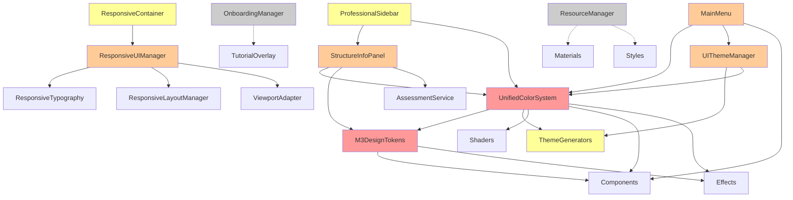

# UI Migration Status

**Created**: 2025-06-15  
**Status**: Planning Phase  
**Risk Level**: High  
**Estimated Effort**: 40-60 hours

## Table of Contents
1. [Current UI File Inventory](#current-ui-file-inventory)
2. [Proposed New Structure](#proposed-new-structure)
3. [Dependency Graph](#dependency-graph)
4. [Risk Assessment](#risk-assessment)
5. [Migration Phases](#migration-phases)
6. [Rollback Plan](#rollback-plan)
7. [Validation Checklist](#validation-checklist)

## Current UI File Inventory

### Overview
- **Total Files**: 78 files
- **Total Size**: ~450KB (excluding .import files)
- **Directories**: 11 main directories
- **Critical Dependencies**: 12 external files depend on UI components

### Complete File Listing with Proposed Locations

#### `/animations/` (1 file)
| Current Path | Proposed Path | Risk | Dependencies |
|-------------|---------------|------|--------------|
| `ButtonMotionHandler.gd` | `/src/components/animations/ButtonMotionHandler.gd` | Low | None |

#### `/components/` (17 files)
| Current Path | Proposed Path | Risk | Dependencies |
|-------------|---------------|------|--------------|
| `AdvancedEducationalInfoPanel.gd` | `/src/components/panels/AdvancedEducationalInfoPanel.gd` | Medium | StructureInfoPanel |
| `EnhancedButton.gd` | `/src/components/controls/EnhancedButton.gd` | Low | None |
| `ModelManipulationPanel.gd` | `/src/components/panels/ModelManipulationPanel.gd` | Medium | Theme system |
| `PooledQuizButton.gd` | `/src/components/controls/PooledQuizButton.gd` | Low | UIPoolManager |
| `ProfessionalSidebar.gd` | `/src/components/layout/ProfessionalSidebar.gd` | High | Multiple panels |
| `ProgressiveDisclosurePanel.gd/.tscn` | `/src/components/panels/ProgressiveDisclosurePanel.*` | Medium | Theme system |
| `QuizPanel.gd/.tscn` | `/src/components/panels/QuizPanel.*` | Medium | AssessmentService |
| `ResponsiveContainer.gd` | `/src/components/layout/ResponsiveContainer.gd` | High | ResponsiveUIManager |
| `SearchPanel.gd` | `/src/components/panels/SearchPanel.gd` | Low | None |
| `StructureInfoPanel.gd/.tscn` | `/src/components/panels/StructureInfoPanel.*` | High | Multiple systems |
| `ThemePreviewPanel.gd/.tscn` | `/src/components/debug/ThemePreviewPanel.*` | Low | Theme system |
| `ThemeSelector.gd` | `/src/components/controls/ThemeSelector.gd` | Medium | UIThemeManager |
| `TutorialOverlay.gd/.tscn` | `/src/components/overlays/TutorialOverlay.*` | Medium | OnboardingManager |

#### `/debug/` (3 files)
| Current Path | Proposed Path | Risk | Dependencies |
|-------------|---------------|------|--------------|
| `DebugMenu.gd/.tscn` | `/src/debug/ui/DebugMenu.*` | Low | Debug systems |

#### `/effects/` (8 files)
| Current Path | Proposed Path | Risk | Dependencies |
|-------------|---------------|------|--------------|
| `ThemeEffectsManager.gd` | `/src/systems/theme/effects/ThemeEffectsManager.gd` | Medium | Shader system |
| `materials/MedicalGlassV2Material.gd` | `/src/materials/ui/MedicalGlassV2Material.gd` | Low | Shaders |
| `shaders/*.gdshader` | `/assets/shaders/ui/*.gdshader` | High | Many components |

#### `/examples/` (3 files)
| Current Path | Proposed Path | Risk | Dependencies |
|-------------|---------------|------|--------------|
| `MedicalGlassDemo.gd/.tscn` | `/examples/ui/MedicalGlassDemo.*` | Low | Demo only |

#### `/overlays/` (0 files)
- Empty directory - can be removed

#### `/panels/` (1 file)
| Current Path | Proposed Path | Risk | Dependencies |
|-------------|---------------|------|--------------|
| `UIThemeManager.gd` | *Already in autoload* | N/A | N/A |

#### `/resources/` (7 files)
| Current Path | Proposed Path | Risk | Dependencies |
|-------------|---------------|------|--------------|
| `materials/GlassPanelMaterial.tres` | `/assets/materials/ui/GlassPanelMaterial.tres` | Medium | ResourceManager |
| `styles/*.tres` | `/assets/styles/ui/*.tres` | Medium | Multiple components |

#### `/screens/` (3 files)
| Current Path | Proposed Path | Risk | Dependencies |
|-------------|---------------|------|--------------|
| `MainMenu.gd/.tscn` | `/src/scenes/ui/MainMenu.*` | High | Entry point |
| `M3ThemeShowcase.gd` | `/examples/ui/M3ThemeShowcase.gd` | Low | Demo only |

#### `/systems/` (6 files)
| Current Path | Proposed Path | Risk | Dependencies |
|-------------|---------------|------|--------------|
| `ButtonMotionHandler.gd` | `/src/systems/ui/ButtonMotionHandler.gd` | Low | None |
| `ResponsiveLayoutManager.gd` | `/src/systems/ui/ResponsiveLayoutManager.gd` | High | Core system |
| `ResponsiveTypography.gd` | `/src/systems/ui/ResponsiveTypography.gd` | High | Core system |
| `ResponsiveUIManager.gd` | *Move to autoload* | High | Singleton |
| `ViewportAdapter.gd` | `/src/systems/ui/ViewportAdapter.gd` | High | Core system |

#### `/themes/` (28 files)
| Current Path | Proposed Path | Risk | Dependencies |
|-------------|---------------|------|--------------|
| `core/M3DesignTokens.gd` | `/src/systems/theme/core/M3DesignTokens.gd` | Critical | Everything |
| `core/UnifiedColorSystem.gd` | `/src/systems/theme/core/UnifiedColorSystem.gd` | Critical | Everything |
| `generators/*.gd` | `/src/systems/theme/generators/*.gd` | Medium | Build tools |
| `presets/ThemePresetManager.gd` | `/src/systems/theme/presets/ThemePresetManager.gd` | Medium | Theme system |
| `resources/themes/*.tres` | `/assets/themes/*.tres` | High | All UI |
| `utilities/*.gd` | `/src/systems/theme/utilities/*.gd` | Medium | Theme system |
| `validation/*.gd` | `/src/systems/theme/validation/*.gd` | Low | Dev tools |
| `archive/*.gd` | `/archive/ui/themes/*.gd` | Low | Legacy code |

## Proposed New Structure

```
src/
├── autoload/              # Existing autoloads + ResponsiveUIManager
├── components/
│   ├── animations/        # Animation handlers
│   ├── controls/          # Basic UI controls (buttons, selectors)
│   ├── layout/            # Layout containers and managers
│   ├── overlays/          # Overlay components (tutorials, modals)
│   └── panels/            # Complex panels (info, quiz, etc)
├── debug/
│   └── ui/                # Debug UI components
├── materials/
│   └── ui/                # UI-specific materials
├── scenes/
│   └── ui/                # UI scenes (MainMenu, etc)
├── systems/
│   ├── theme/
│   │   ├── core/          # Core theme system (tokens, colors)
│   │   ├── effects/       # Visual effects managers
│   │   ├── generators/    # Theme generation tools
│   │   ├── presets/       # Theme preset management
│   │   ├── utilities/     # Theme utilities
│   │   └── validation/    # Theme validation tools
│   └── ui/                # UI system components

assets/
├── materials/
│   └── ui/                # UI material resources
├── shaders/
│   └── ui/                # UI shaders
├── styles/
│   └── ui/                # UI style resources
└── themes/                # Generated theme resources

examples/
└── ui/                    # UI examples and demos

archive/
└── ui/
    └── themes/            # Archived theme code
```

## Dependency Graph

### Critical Dependencies



### Import Dependency Matrix

| Component | Depends On | Depended By | Risk |
|-----------|------------|-------------|------|
| UnifiedColorSystem | None | 25+ files | Critical |
| M3DesignTokens | None | 20+ files | Critical |
| ResponsiveUIManager | 3 subsystems | 5 files | High |
| StructureInfoPanel | 4+ systems | 2 files | High |
| MainMenu | 3+ components | Entry point | High |
| ThemeGenerators | Theme core | Build system | Medium |
| EnhancedButton | None | Unknown | Low |

## Risk Assessment

### Critical Risk Components (Must migrate together)
1. **UnifiedColorSystem & M3DesignTokens**
   - **Risk**: Breaking all UI colors and animations
   - **Mitigation**: Migrate together in Phase 1
   - **Dependencies**: Used by 90% of UI components
   - **Testing**: Comprehensive color validation required

2. **UI Shaders**
   - **Risk**: Breaking visual effects across all panels
   - **Mitigation**: Update all shader paths atomically
   - **Dependencies**: MedicalGlass effects, theme transitions
   - **Testing**: Visual regression testing

### High Risk Components
1. **ResponsiveUIManager**
   - **Risk**: Breaking responsive layout system
   - **Mitigation**: Test on multiple resolutions
   - **Dependencies**: Autoload with 3 subsystems
   - **Testing**: Multi-device testing required

2. **MainMenu**
   - **Risk**: Breaking application entry point
   - **Mitigation**: Update all scene references
   - **Dependencies**: Hardcoded scene paths
   - **Testing**: Full application launch testing

3. **StructureInfoPanel**
   - **Risk**: Breaking core educational features
   - **Mitigation**: Verify all data bindings
   - **Dependencies**: Multiple external systems
   - **Testing**: Integration testing with brain models

### Medium Risk Components
1. **Theme Generators**
   - **Risk**: Breaking theme generation pipeline
   - **Mitigation**: Update build scripts
   - **Dependencies**: Used in development only
   - **Testing**: Theme generation verification

2. **Component Panels**
   - **Risk**: UI functionality degradation
   - **Mitigation**: Test each panel individually
   - **Dependencies**: Theme system, data services
   - **Testing**: Component-level testing

### Low Risk Components
1. **Standalone Controls**
   - **Risk**: Minimal, self-contained
   - **Mitigation**: Simple path updates
   - **Dependencies**: None or minimal
   - **Testing**: Basic functionality tests

2. **Examples/Demos**
   - **Risk**: Non-critical, development only
   - **Mitigation**: Update after main migration
   - **Dependencies**: Various UI components
   - **Testing**: Manual verification

## Migration Phases

### Phase 1: Foundation (Day 1)
**Goal**: Establish core theme system in new location

1. Create new directory structure
2. Migrate `UnifiedColorSystem` and `M3DesignTokens`
3. Update autoload paths in project.godot
4. Run color validation tests
5. **Checkpoint**: All colors resolve correctly

### Phase 2: Resources & Assets (Day 2)
**Goal**: Move all resource files to assets/

1. Move shaders to `assets/shaders/ui/`
2. Move materials to `assets/materials/ui/`
3. Move styles to `assets/styles/ui/`
4. Move theme resources to `assets/themes/`
5. Update all resource references
6. **Checkpoint**: All resources load correctly

### Phase 3: Core Systems (Day 3)
**Goal**: Migrate system-level components

1. Move ResponsiveUIManager to autoload
2. Migrate responsive subsystems
3. Move theme utilities and generators
4. Update all system references
5. **Checkpoint**: Responsive system functional

### Phase 4: Components (Day 4-5)
**Goal**: Migrate all UI components

1. Move standalone controls first
2. Move panels with dependencies
3. Move layout components
4. Update all import paths
5. **Checkpoint**: All components instantiate

### Phase 5: Integration (Day 6)
**Goal**: Final integration and testing

1. Update MainMenu and other scenes
2. Fix remaining path references
3. Update external dependencies
4. Remove old ui/ directory
5. **Checkpoint**: Full application functional

## Rollback Plan

### Preparation
1. **Full Backup**: `src/ui_backup_[timestamp]` already created
2. **Git Branch**: Create `ui-migration` branch before starting
3. **Checkpoint Commits**: Commit after each successful phase

### Rollback Procedures

#### Quick Rollback (< 5 minutes)
```bash
# If migration fails at any phase
git checkout main
cp -r src/ui_backup_[timestamp]/* src/ui/
godot --clear-cache
```

#### Phase-Specific Rollback

**Phase 1 Failure** (Theme Core):
```bash
# Restore autoload configurations
git checkout project.godot
# Restore theme core files
cp -r src/ui_backup_*/themes/core/* src/ui/themes/core/
```

**Phase 2 Failure** (Resources):
```bash
# Restore all resource files
cp -r src/ui_backup_*/resources/* src/ui/resources/
cp -r src/ui_backup_*/effects/shaders/* src/ui/effects/shaders/
# Clear Godot cache
rm -rf .godot/
```

**Phase 3-5 Failure** (Components):
```bash
# Full restoration recommended
git reset --hard [last-good-commit]
cp -r src/ui_backup_[timestamp]/* src/ui/
```

### Emergency Recovery
1. **Complete Failure**: 
   - Switch to `main` branch
   - Restore from `ui_backup_[timestamp]`
   - Document failure points

2. **Partial Success**:
   - Identify working components
   - Selective rollback of failed components
   - Create hybrid structure temporarily

3. **Data Corruption**:
   - Use `.git` history
   - Restore from time-stamped backup
   - Verify project.godot integrity

## Validation Checklist

### Pre-Migration
- [ ] All tests passing
- [ ] Backup created and verified
- [ ] Migration branch created
- [ ] Team notified of migration window
- [ ] Documentation updated

### Per-Phase Validation
- [ ] All moved files accessible
- [ ] No missing dependencies errors
- [ ] Theme colors rendering correctly
- [ ] Responsive layouts working
- [ ] No console errors on startup

### Post-Migration
- [ ] Full application test suite passes
- [ ] All UI components render correctly
- [ ] Theme switching works
- [ ] Responsive behavior intact
- [ ] Performance metrics unchanged
- [ ] No regression in functionality

### Final Verification
- [ ] Remove old ui/ directory
- [ ] Update all documentation
- [ ] Close migration branch
- [ ] Team sign-off completed
- [ ] Backup archived

## Known Issues & Workarounds

### Issue 1: Hardcoded Paths
**Problem**: Some components have hardcoded "res://src/ui/" paths  
**Solution**: Global find/replace after each phase  
**Affected Files**: MainMenu.gd, resource references

### Issue 2: Circular Dependencies
**Problem**: Theme system has circular reference potential  
**Solution**: Use lazy loading for theme generators  
**Affected**: Theme generator scripts

### Issue 3: Autoload Order
**Problem**: ResponsiveUIManager depends on other autoloads  
**Solution**: Verify autoload order in project.godot  
**Affected**: All autoload systems

### Issue 4: Shader Path Resolution
**Problem**: Shaders referenced in materials with relative paths  
**Solution**: Use absolute paths during migration  
**Affected**: All .gdshader files

## Success Metrics

1. **Zero Runtime Errors**: No errors in console after migration
2. **Performance Maintained**: FPS and load times unchanged
3. **All Tests Pass**: 100% of existing tests still pass
4. **Feature Parity**: All UI features work as before
5. **Clean Structure**: New organization improves maintainability

## Next Steps

1. Review and approve migration plan
2. Schedule migration window (6-8 hours recommended)
3. Assign team members to phases
4. Prepare communication plan
5. Execute Phase 1 as pilot

---

**Document Version**: 1.0  
**Last Updated**: 2025-06-15  
**Author**: UI Migration Planning Team  
**Approval Status**: Pending Review