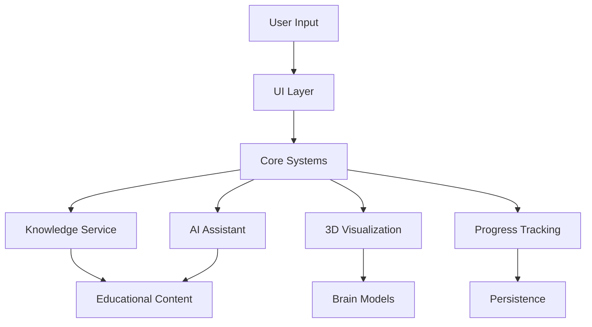

# NeuroVision Clean Architecture Documentation

## Overview

This document describes the clean, modular architecture of the NeuroVision educational neuroanatomy platform after the consolidation and restructuring completed on 2025-06-18.

## Architecture Principles

### 1. **Separation of Concerns**
- Core business logic in `/src/core/`
- UI components in `/src/ui_atomic/`
- 3D visualization systems in `/src/systems/3d_interaction/`
- Educational content in `/assets/data/`

### 2. **Atomic Design Pattern**
- UI built with atomic components (atoms → molecules → organisms → templates → pages)
- Reusable, testable components
- Consistent design system implementation

### 3. **Educational Focus**
- Accessibility-first design (WCAG AAA compliance)
- Performance optimization for Intel UHD 620
- Clear learning pathways and progress tracking

## Directory Structure

```
NeuroVision-Repo/
├── assets/                         # Educational content and resources
│   ├── 3d_models/                 # Brain models with LOD variants
│   │   ├── processed/             # Optimized models
│   │   └── raw/                   # Source models
│   ├── data/                      # Educational content
│   │   └── anatomical_data.json   # Brain structure information
│   └── materials/                 # Shared materials and textures
│
├── docs/                          # Comprehensive documentation
│   ├── architecture/              # System architecture docs
│   ├── dev/                       # Developer guides
│   ├── roadmap/                   # Project roadmap
│   └── setup/                     # Setup instructions
│
├── scenes/                        # Godot scene files
│   ├── 3d/                       # 3D visualization scenes
│   │   └── EnhancedExplorationScene.tscn
│   └── ui/                       # UI scene files
│       └── MainMenu.tscn
│
├── src/                          # Source code
│   ├── autoload/                 # Global singleton services
│   │   ├── UnifiedColorManager.gd
│   │   ├── ProgressTracker.gd
│   │   └── NetworkManager.gd
│   │
│   ├── core/                     # Core business logic
│   │   ├── ai/                   # AI educational assistant
│   │   ├── config/               # Configuration classes
│   │   ├── interaction/          # 3D interaction systems
│   │   ├── knowledge/            # Educational content management
│   │   ├── managers/             # System managers
│   │   └── models/               # Model management
│   │
│   ├── systems/                  # Specialized systems
│   │   ├── 3d_interaction/       # 3D visualization
│   │   ├── assessment/           # Learning assessment
│   │   └── ui/                   # UI utilities
│   │
│   └── ui_atomic/                # Atomic UI components
│       ├── atoms/                # Basic UI elements
│       ├── molecules/            # Composite components
│       ├── organisms/            # Complex UI sections
│       ├── templates/            # Page templates
│       ├── pages/                # Complete pages
│       ├── themes/               # Theme system
│       └── effects/              # Visual effects
│
├── tests/                        # Test suites
├── tools/                        # Development tools
└── project.godot                 # Godot project configuration
```

## Key Systems

### 1. **Autoload Services** (Global Singletons)

#### Core Services
- `UnifiedColorManager` - Centralized color and theme management
- `CoreSystemManager` - Core system initialization and coordination
- `UISystemManager` - UI component management
- `EducationalPlatformManager` - Educational feature coordination
- `ResourceManager` - Centralized resource loading and caching

#### Support Services
- `ButtonMotionHandler` - UI animation utilities
- `AuthenticationManager` - User authentication
- `NetworkManager` - Network communication
- `AssessmentService` - Learning assessment
- `HighlightMaterialManager` - 3D material highlighting
- `ProgressTracker` - User progress persistence

### 2. **Core Systems** (`/src/core/`)

#### AI System (`/src/core/ai/`)
- `AIAssistantService` - Educational AI assistant for answering questions

#### Interaction System (`/src/core/interaction/`)
- `BrainStructureSelectionManager` - 3D structure selection
- `CameraBehaviorController` - Educational camera controls
- `ImprovedBrainInteractionController` - Enhanced 3D interaction

#### Knowledge System (`/src/core/knowledge/`)
- `KnowledgeService` - Modern educational content service
- `AnatomicalKnowledgeDatabase` - Legacy system (deprecated)

#### Model Management (`/src/core/models/`)
- `ModelRegistry` - 3D model coordination
- `ModelVisibilityManager` - Layer-based visualization

### 3. **UI System** (`/src/ui_atomic/`)

#### Atomic Components
- **Atoms**: Buttons, labels, icons, inputs
- **Molecules**: Cards, tooltips, dropdowns
- **Organisms**: Panels, navigation, dashboards
- **Templates**: Layout templates
- **Pages**: Complete application pages

#### Theme System
- Material 3 Design implementation
- Dark/Light/High-contrast themes
- Accessibility-first design
- Educational color system

### 4. **3D Visualization** (`/src/systems/3d_interaction/`)

- `ModelLoader` - LOD-aware model loading
- `SafeModelLoader` - Error-handling model loader
- `HighlightMaterialManager` - Selection highlighting
- `GPUDetector` - Hardware detection for optimization

## Data Flow



## Resource Management

### Model Loading
1. Models stored in `/assets/3d_models/`
2. LOD variants: `_high`, `_medium`, `_low`
3. Automatic quality selection based on GPU
4. Fallback to low-quality for Intel UHD 620

### Resource Caching
- Centralized through `ResourceManager`
- Three cache policies: PERMANENT, TEMPORARY, SESSION
- Automatic cleanup and memory management
- Maximum cache size: 256MB

## Error Handling

### Model Loading Errors
- `SafeModelLoader` provides fallback mechanisms
- Error placeholders shown when models fail to load
- Clear error messages for debugging

### RID Leak Prevention
All autoloads implement `_exit_tree()` cleanup:
- Clear resource caches
- Stop timers
- Free pooled materials
- Clean up references

## Performance Optimizations

### Intel UHD 620 Support
- Force lowest LOD models
- Simplified shaders
- Reduced visual effects
- 60fps target maintained

### Memory Management
- Resource pooling for materials
- Automatic cache cleanup
- Progressive loading
- Scene optimization

## Testing

### Test Structure
```
tests/
├── ui_atomic/         # UI component tests
├── core/              # Core system tests
├── integration/       # Integration tests
└── performance/       # Performance benchmarks
```

### Key Test Commands
```bash
# Run all tests
./tools/scripts/quick_test.sh

# Test autoloads
test autoloads

# Test UI safety
test ui_safety

# Test infrastructure
test infrastructure
```

## Development Workflow

### Adding New Features
1. Determine appropriate directory based on feature type
2. Follow naming conventions (PascalCase for classes, snake_case for files)
3. Include educational context in documentation
4. Add tests for new functionality
5. Update relevant documentation

### Code Quality
- Pre-commit hooks enforce standards
- Automatic formatting on save
- GDScript linting
- Documentation requirements

## Migration Notes

### From Old Structure
- UI systems consolidated from 3 to 1 (ui_atomic)
- Deep nesting reduced from 6+ to 3-4 levels
- Scattered documentation organized into /docs/
- Model paths updated to /assets/3d_models/

### Breaking Changes
- ButtonMotionHandler moved to autoload
- UI paths changed from /src/ui/ to /src/ui_atomic/
- Scene files separated into /scenes/
- Model paths updated

## Future Improvements

### Planned Enhancements
1. Enhanced error recovery
2. Improved model streaming
3. Advanced accessibility features
4. Multi-user collaboration
5. Cloud synchronization

### Technical Debt
- Complete migration from legacy KB to KnowledgeService
- Implement comprehensive error boundaries
- Add telemetry for learning analytics
- Optimize shader compilation

---

**Last Updated**: 2025-06-18
**Maintainer**: NeuroVision Development Team
**Version**: 2.0.0