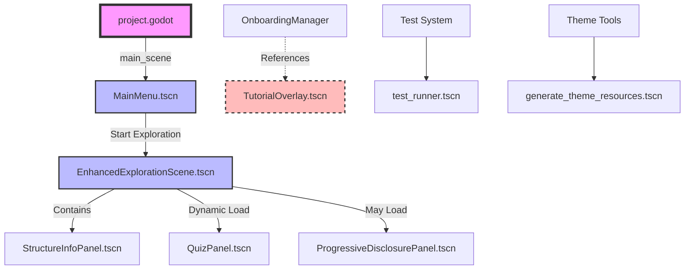
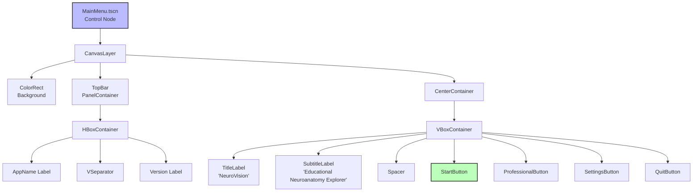
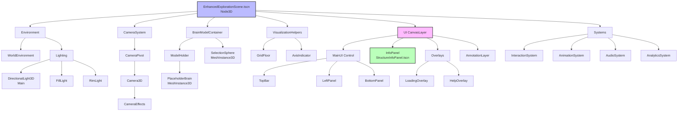
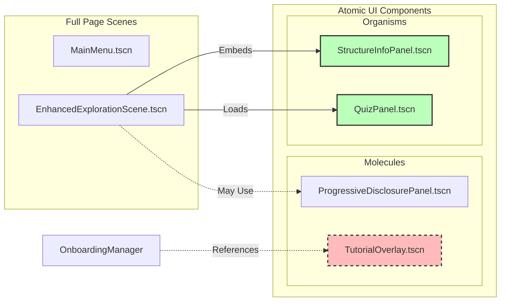
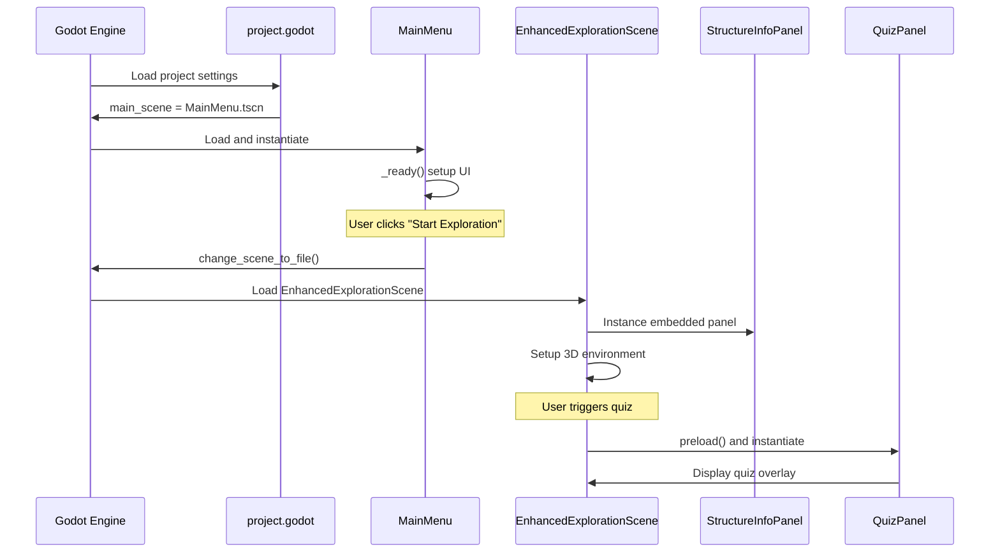
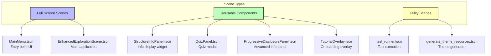
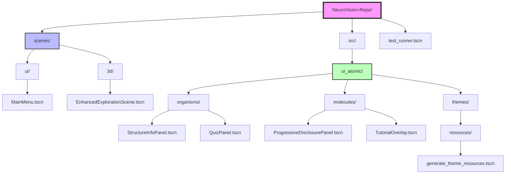
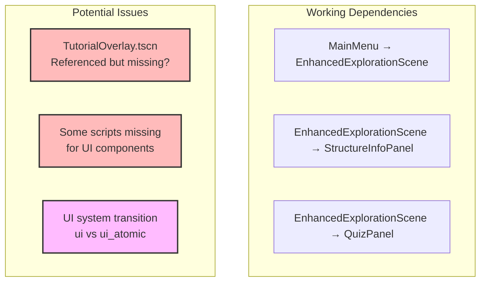

# NeuroVision Scene Structure Documentation

This document visualizes the scene hierarchy and relationships in the NeuroVision educational neuroanatomy platform using Mermaid.js diagrams.

## Scene Hierarchy Overview

## Detailed Scene Component Structure

### MainMenu Scene Structure

### EnhancedExplorationScene Structure

## UI Component Scene Relationships

## Scene Loading Flow

## Scene Component Types

## Scene File Organization

## Scene Dependencies and Issues

## Key Observations

1. **Atomic Design Pattern**: The project uses atomic design with organisms and molecules for UI components
2. **Scene Reusability**: UI components are designed as reusable scenes that can be instantiated in multiple places
3. **Clear Separation**: Full application scenes vs. reusable components vs. utility scenes
4. **Simple Flow**: Main application flow is straightforward: MainMenu → EnhancedExplorationScene
5. **Dynamic Loading**: Some components (like QuizPanel) are loaded on-demand rather than embedded
6. **Migration Evidence**: The ui_atomic directory structure suggests an ongoing or completed UI system migration

## Scene Best Practices Used

- ✅ Modular scene design
- ✅ Reusable UI components
- ✅ Clear naming conventions
- ✅ Organized directory structure
- ✅ Separation of concerns (UI vs 3D vs systems)
- ✅ Dynamic loading for performance
- ✅ Atomic design pattern implementation

---

*Last Updated: 2025-06-18*